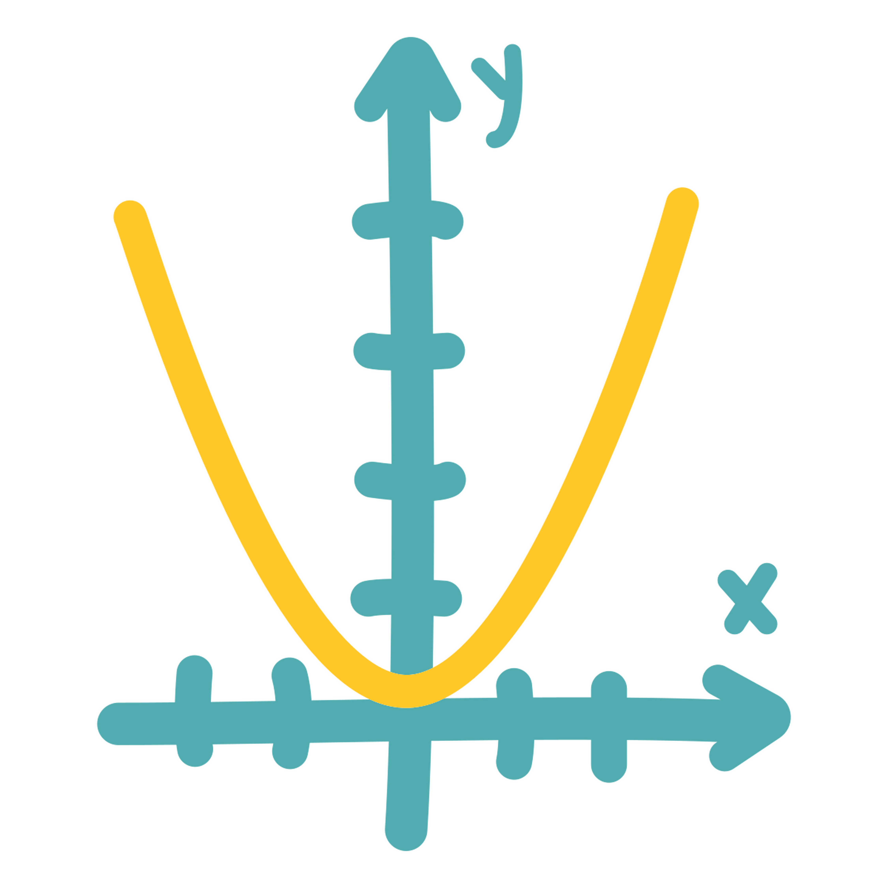
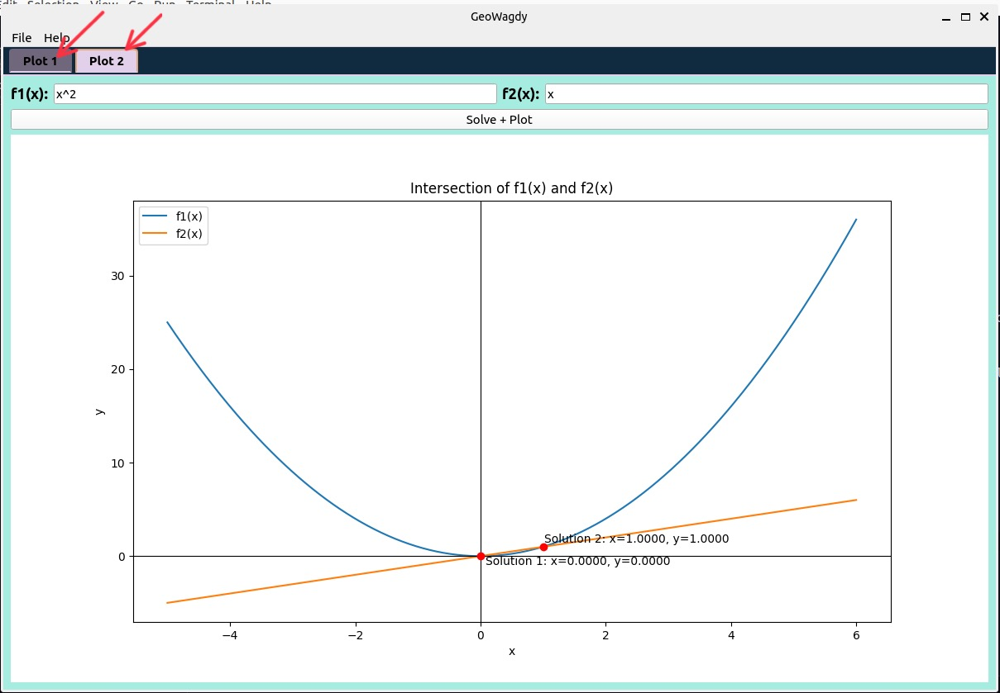
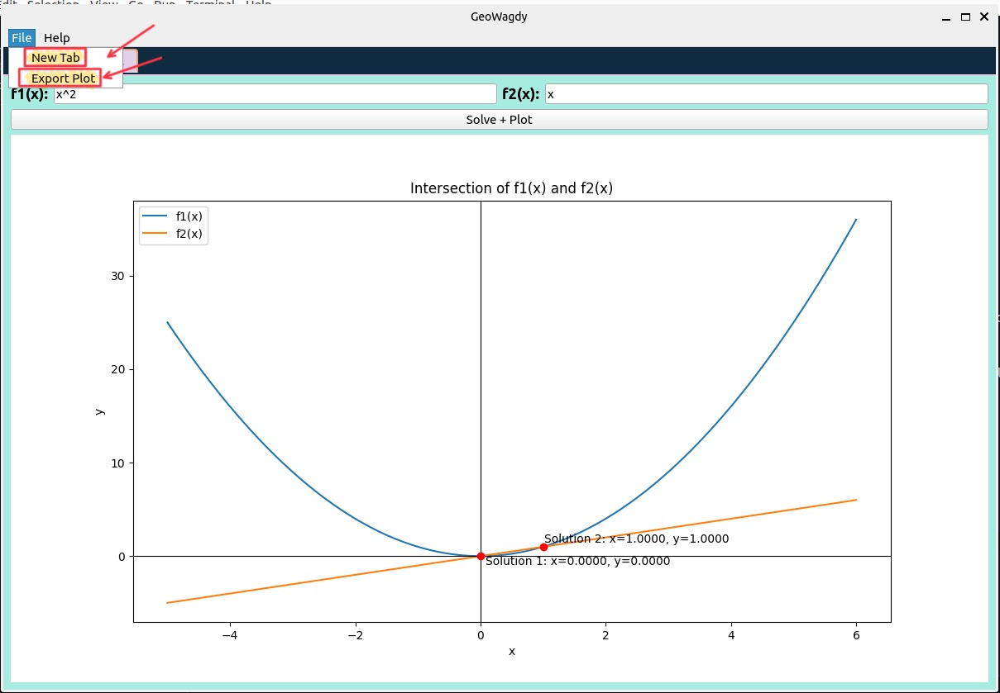
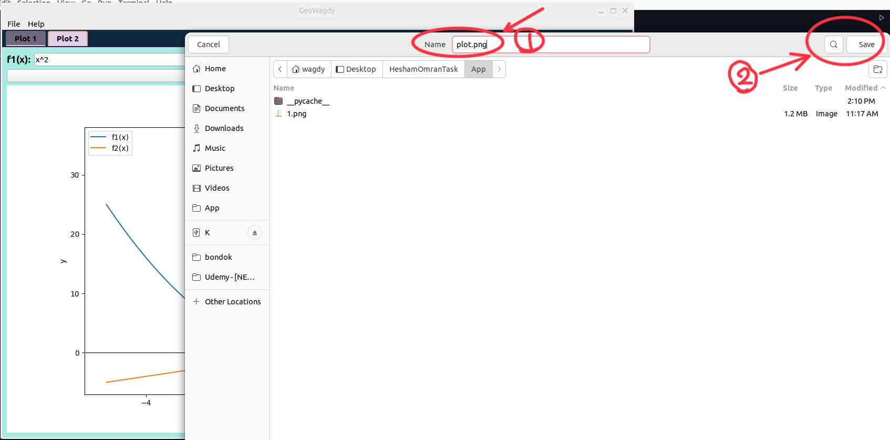
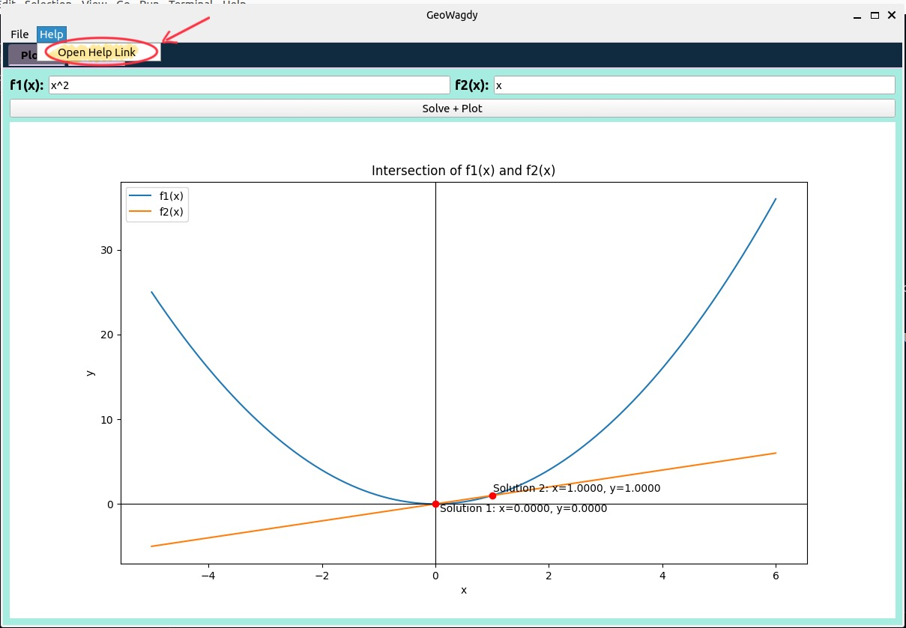
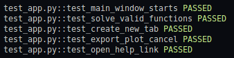

# GeoWagdy - Function Intersection Plotter


**GeoWagdy** is a Python desktop application (built with **PySide2**) that helps you:
- Enter two **mathematical functions** of `x`.
- Solve for all **real intersections** (where `f1(x) = f2(x)`).
- Plot both functions on a **cartesian** plane, marking intersection points.
- Export the **plot** to a PNG/JPEG file.
- Create multiple **tabs** to handle multiple sets of functions at once.
- Access a "Help" menu that opens a link in your default browser.

## Table of Contents
1. [Features](#features)
2. [Installation](#installation)
3. [How to Run](#how-to-run)
4. [Usage Instructions](#usage-instructions)
5. [Running the Automated Tests](#running-the-automated-tests)
6. [Known Limitations](#known-limitations)
7. [License](#license)

---

## Features
- **GUI** with a **Splash Screen** and **Progress Bar**.
- 
- 
- **Multiple Tabs** (each is an independent plotting environment).
- 
- **Plot** with embedded **Matplotlib**.
- **Accepts** operators: `+`, `-`, `*`, `/`, `^` (as `**`), `log10()`, `sqrt()`, etc.
- **Exports** your plot to `png`/`jpeg`.
- 
- **Help** menu to open an external documentation link.
- 
- **Automated Tests** with `pytest` and `pytest-qt`.
- 
---


# Download :
  - ### For Windows:
   

  - ### For Linux:


## If you want to use the source code instead of Downloading the exe file
1. **Python 3.9+** is recommended (though 3.6+ may work).
2. Install the required dependencies:

   ```bash
   pip install -r requirements.txt
   ```

   ---

## How to Run

1. **Clone or Download** this repository.
2. **Open a terminal** in the project folder.
3. **Run the application**:

   ```bash
   python app.py
   ```

   Alternatively, if your main script has a different name, run:

   ```bash
   python <yourfilename>.py
   ```

4. The **Splash Screen** will appear briefly, followed by the **Main Window**.

---

## Usage Instructions

On startup, you’ll see a single tab containing:

- **Two input fields**: `f1(x)` and `f2(x)`.
- **A button labeled “Solve + Plot”**.

### Steps:

1. **Enter your functions** in the input fields (e.g., `"x"`, `"2*x"`, `"sqrt(x) + 1"`, etc.).
2. **Click “Solve + Plot”**:
   - If **real intersections exist**, they’ll be **plotted and annotated**.
   - If **no real intersection** exists, a message will appear, but the functions will still be plotted.

### Additional Features:

- **Add new tabs**: Go to **File → New Tab** to open another tab.
- **Export your plot**: Use **File → Export Plot** to save the current tab’s plot.
- **Help**: Access **Help → Open Help Link** to open documentation in your browser.

---

## Running Automated Tests

Ensure you have `pytest` and `pytest-qt` installed:

```bash
pip install pytest pytest-qt
```

Then, in the project directory, run:

```bash
pytest -v
```

### Expected Output:

If all tests pass, you’ll see something like:

```plaintext
================= test session starts =================
...
test_app.py::test_main_window_starts PASSED
test_app.py::test_solve_valid_functions PASSED
...
================= 6 passed in 1.23s ====================
```

If any test fails, `pytest` will display a **FAIL** message with details.

---

## License

This project is licensed under the MIT License. See `LICENSE` for details.

---


## Contact

For any questions or support, please open an issue in the repository.
```
